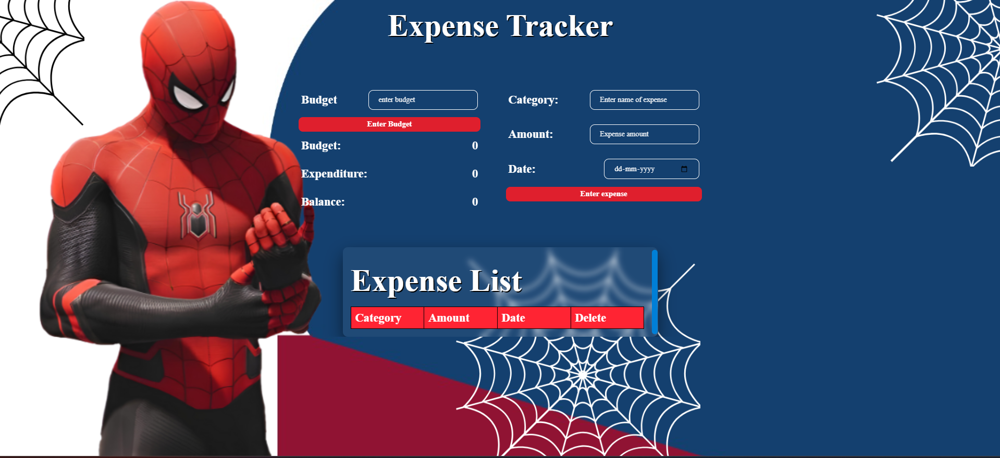

# 💻 Into the Webverse - Expense Tracker Workshop

# [Visit the final website here](https://webverse.kjsce.hosting.acm.org/)


<a href="https://webverse.kjsce.hosting.acm.org/"></a>


Presented by KJSCE-ACM

🚀 Into the Webverse is an immersive code-along workshop where you'll build a fully functional Expense Tracker using the fundamentals of web development. Whether you're a beginner or looking to refine your skills, this hands-on session will guide you through the core concepts, ensuring a streamlined and engaging learning experience.

# ✨ What You’ll Learn  

✅ Basics of HTML, CSS, and JavaScript  
✅ Managing state and handling user inputs  
✅ Working with local storage for data persistence  
✅ Building a responsive and interactive UI


# 🚀 Git & GitHub  

## 📌 Installation  

### 🔹 Windows  
1. Download Git from [Windows Git Download](https://git-scm.com/downloads/win).  
2. Run the installer and follow the setup instructions.  

### 🔹 macOS  
1. First, install **Homebrew** by running the following command in your terminal:  
   ```sh
   /bin/bash -c "$(curl -fsSL https://raw.githubusercontent.com/Homebrew/install/HEAD/install.sh)"
   ```
2. ```sh
   brew install git
   ```
   
## ⚙️ Git & GitHub Setup
1. Verify Git Installation
Open Command Prompt and run:
```sh
  git --version
 ```
2. Set Up Git Username & Email
Configure your Git identity (used for commits):
```sh
  git config --global user.name "Your Name"
  git config --global user.email "your-email@example.com"
```

3. Clone a Repository
 ```sh
   git clone "repository-link"
 ```
## ⚡ Basic Git Commands
1. ```git add .```	Adds all changes to the staging area.
2. ```git commit -m "message"```	Saves the changes to the local repository.
3. ```git push origin main```	Uploads the changes to GitHub.
4. ```git pull origin main```	Fetches updates from GitHub and merges them locally.

## 🌍 GitHub
GitHub is a cloud-based platform that integrates with Git, allowing you to:
<ul>
  <li>Store and manage your projects in remote repositories.</li>
  <li>Collaborate with teammates and contribute to open-source projects.</li>
  <li>Keep track of changes, issues, and different versions of your code.</li>
  <li>Showcase your work and build a strong portfolio.</li>
</ul>

# ⭐ Folder Structure
```
Into-The-Webverse
├─── demonstration
│    └─── css
│      └─── flex.html
│      └─── absolute-relative.html
│      └─── font.html
│      └─── invert.html
│      └─── media-query.html
│      └─── mp.html
│      └─── overflow.html
│      └─── z-index.html
│    └─── js
│      └─── js.html
│      └─── script.js
├─── expense-tracker
│      └─── assets
│      └─── index.html
│      └─── index.css
│      └─── index.js
├─── README.md  
```

<h1 align= "center">Made with ❤️ by KJSCE-ACM</h1>

